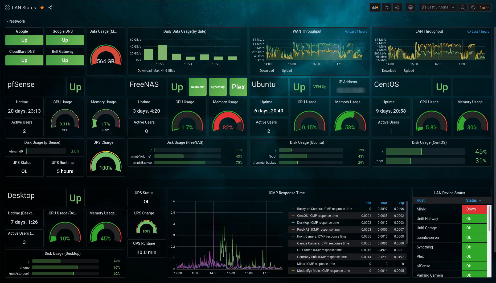
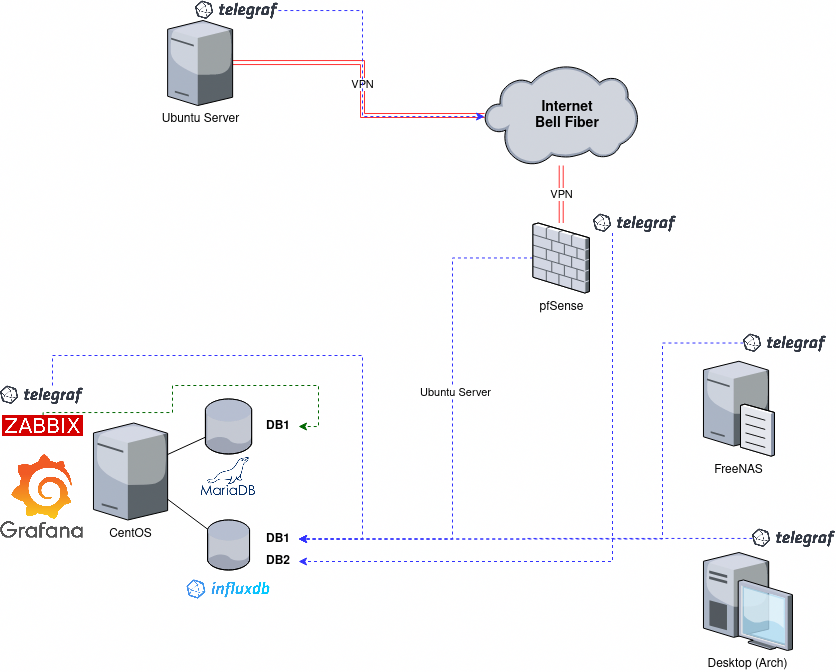

# my_grafana_lan_dashboard
JSON Model for my Grafana dashboard

Grafana [model.json](model.json)

For more information see my blog post - [Overview of My Grafana Setup](https://blog.victormendonca.com/2020/10/30/my-grafana-setup/).

- - -

#### The Grafana Server

+ **OS:** CentOS 7
+ **Databases**:
    + InfluxDB
      + DB1 - pfsense
      + DB2 - Linux/FreeNAS
    + MariaDB
      + zabbix
+ **Plugins**:
  + Zabbix - [Zabbix plugin for Grafana \| Grafana Labs](https://grafana.com/grafana/plugins/alexanderzobnin-zabbix-app)
  + worldPing - [worldPing plugin for Grafana \| Grafana Labs](https://grafana.com/grafana/plugins/raintank-worldping-app)
  + Pie Chart - [Pie Chart plugin for Grafana \| Grafana Labs](https://grafana.com/grafana/plugins/grafana-piechart-panel)
  + Status Panel - [Status Panel plugin for Grafana \| Grafana Labs](https://grafana.com/grafana/plugins/vonage-status-panel)
+ **Imported Dashboards**:
  + [pfSense System Dashboard dashboard for Grafana \| Grafana Labs](https://grafana.com/grafana/dashboards/12023)
  + [Telegraf: system dashboard dashboard for Grafana \| Grafana Labs](https://grafana.com/grafana/dashboards/928)

#### Collectors

+ **CentOS** (also the Grafana server)
  + Zabbix => MariaDB
      + Collects LAN statistics
  + telegraf => InfluxDB (DB2)
      + Collects server resources
+ **pfSense**
  + telegraf => InfluxDB (DB1)
      + Collects server resources, network usage and UPS status
+ **Desktop (Arch)**
  + telegraf => InfluxDB (DB2)
      + Collects server resources and UPS status
+ **FreeNAS**
  + telegraf => InfluxDB (DB2)
      + Collects server resources and ZPOOL status/usage
+ **Ubuntu**
  + telegraf => InfluxDB (DB2)
      + Collects server resources, VPN status, IP address and ZPOOL status/usage

#### Diagram

